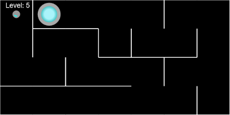

SPACE MAZE
==========

## Game

Small maze game on canvas, in space. Find your way through the maze to reach the stargate!

### Inspiration

This project has been inspired by videos from [Dan Shiffman](https://thecodingtrain.com/CodingChallenges/), and is a mashup of different videos from him : maze generation algorithm, asteroids, etc.

## Code : mini canvas framework

Using a small set of files to ease html5 canvas development.

* `src/lib/canvasGameEngine`
* `src/lib/Keys`
* `src/lib/Utils`
* `src/lib/Vector`

### Usage

Check `src/index.js`, but the idea is to create a game class that extends from `canvasGameEngine`.
* Create a `setup()` method, it will be called once at the beginning.
* Create a `loop(elapsedTime)` method, it will be called once every frame. `elapsedTime` is the nb of ms since previous frame.

This is kind of the same approach as in Processing for instance.

## Build system

Using a modified version of ES6-boilerplate, by [metagrover](https://github.com/metagrover/ES6-boilerplate)

Standard ES6 Boilerplate configured with babel, webpack and eslint.
I've changed the rules of eslint, and I've added css and jpg|png support to webpack.

### Usage
* `npm start` to run eslint on watch mode and dev-server at localhost:8080.
* `npm run watch` to only watch for/recompile on changes.
* `npm run build` to generate a minified, production-ready build.
